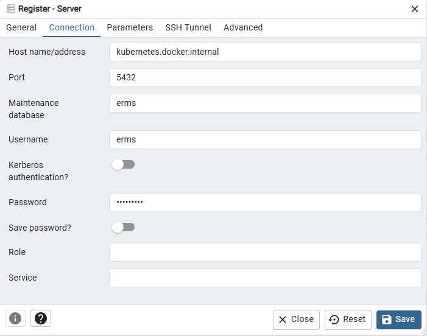

# Getting Started

### Reference Documentation
Building:

* [Official Apache Maven documentation](https://maven.apache.org/guides/index.html)
* [Spring Boot Maven Plugin Reference Guide](https://docs.spring.io/spring-boot/docs/3.3.1/maven-plugin/reference/html/)
* [Create an OCI image](https://docs.spring.io/spring-boot/docs/3.3.1/maven-plugin/reference/html/#build-image)

### Maven build

`mvn package`

### Database

Postgres SQL:

```
docker pull postgres:16.2
```

```
docker run -itd -e POSTGRES_USER=pKanak -e POSTGRES_PASSWORD=heslo1234 -p 5432:5432 -v ./data:/var/lib/postgresql/data --name test-erms postgres:16.2
```

PGAdmin docker image:

```
docker pull dpage/pgadmin4:latest
```

```
docker run --name pk-pgadmin -p 5051:80 -e "PGADMIN_DEFAULT_EMAIL=pk777@gmail.com" -e "PGADMIN_DEFAULT_PASSWORD=heslo1234" -d dpage/pgadmin4
```

Path for PGAdmin from docker image: \ 
http://localhost:5051/login?next=/

user: pk777@gmail.com \
password: heslo1234

#### Important: #### 
If ***host.docker.internal*** doesn't work try ***kubernetes.docker.internal***. Look on hosts (Windows: C:\Windows\System32\drivers\etc) file
what is bind on localhost (127.0.0.1).



### OpenAPI

Api GUI:
http://localhost:8081/swagger-ui/index.html

Api definition in json:
http://localhost:8081/v3/api-docs

### Application information

Application runs at port: 8081.
You can change it in configuration file.

```
server.port=8081
```